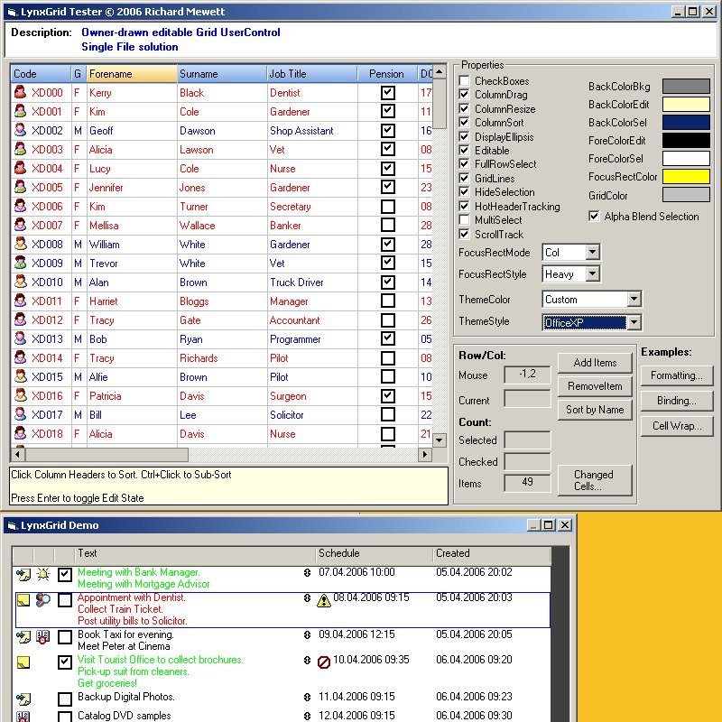



## LynxGrid v1\.89 \(owner\-drawn editable grid\)

### Description

Added FormatCells method for fast bulk formatting and per cell Fontname properties.

Owner-drawn Grid. Features include CheckBoxes, Images, Multi-select, dynamic Column Sorting/Resizing, Cell Formatting (BackColor, ForeColor, FontBold etc), datatype aware sorts, custom sorts, Independent Row Heights, Word Wrap, Column Drag, Cell Images and auto-scrolling (when mouse dragged out of control). A Control Binding System allows external controls to be used for editing Cells (ComboBox, DateTimePicker etc). Supports native XP Themes &amp; emulation of XP/Office XP Themes. Feedback welcome (votes appreciated!) Credits in source for PSC authors who have helped make this possible.
 
### More Info
 

             |
---                |---
**Submitted On**   |2007-03-09 13:20:46
**By**             |[Richard Mewett](https://github.com/Planet-Source-Code/PSCIndex/blob/master/ByAuthor/richard-mewett.md)
**Level**          |Intermediate
**User Rating**    |5.0 (500 globes from 101 users)
**Compatibility**  |VB 6\.0
**Category**       |[Custom Controls/ Forms/  Menus](https://github.com/Planet-Source-Code/PSCIndex/blob/master/ByCategory/custom-controls-forms-menus__1-4.md)
**World**          |[Visual Basic](https://github.com/Planet-Source-Code/PSCIndex/blob/master/ByWorld/visual-basic.md)
**Archive File**   |[LynxGrid\_v2064915102007\.zip](https://github.com/Planet-Source-Code/richard-mewett-lynxgrid-v1-89-owner-drawn-editable-grid__1-65559/archive/master.zip)

